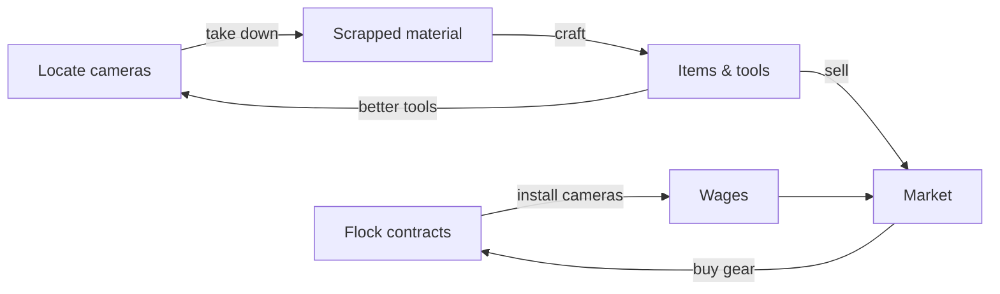

# FlockWatch Specification

This document specifies FlockWatch, a satirical text-based MMORPG about contending with the dystopian deepstate. It covers both the technical architecture and the game design systems.

## 1. Overview

- **Genre:** Satirical text-based MMORPG
- **Premise:** Players navigate a world of bureaucratic menace and quiet surveillance, completing hidden quests, trading on the market, fighting enemies and bosses, and performing espionage.
- **Runtime:** Deno
- **Web framework:** oak (`jsr:@oak/oak`)
- **Dialogue engine:** `grillsay` (git submodule at [tools/grillsay](../tools/grillsay))

## 2. Technical Specification

### 2.1 Architecture

The application is a single Deno entrypoint ([main.ts](../main.ts)) that runs an oak HTTP server on port 8000 and serves static views from the [static/](../static) directory.

```
flockwatch/
├── main.ts            # oak server: routing + static file serving
├── deno.json          # tasks, imports, deploy config
├── static/
│   ├── views/         # HTML views served by the router
│   ├── styles.css     # global styles
│   ├── interactivity.js
│   ├── robots.txt
│   └── sitemap.xml
├── tools/
│   └── grillsay/      # dialogue engine (git submodule)
└── docs/              # this specification, design notes, roadmap
```

### 2.2 Server

The server is started with:

```sh
deno task start
```

This runs `deno run --allow-all --env-file=.env.list main.ts`, loading environment variables from `.env.list`.

### 2.3 Routing

| Route            | Behavior                                                                 |
|------------------|--------------------------------------------------------------------------|
| `GET /`          | Serves `static/views/index.html`                                         |
| `GET /:view.html`| Serves `static/views/<view>.html` with `Content-Type: text/html`; 404 if missing |
| Any other path   | Served from `static/` via oak's `context.send`; falls through to 404 handling |

Route parameters:

- `view` — the view name without extension. Missing files and missing parameters both yield `404`.

### 2.4 Configuration

Defined in [deno.json](../deno.json):

- **Imports:** `oak` from JSR, `twilio` from npm (reserved for notification/communication features).
- **Deploy:** Deno Deploy project with entrypoint `main.ts`; `node_modules` excluded from deployment.
- **Node modules:** `nodeModulesDir: "auto"` for the npm dependency.

### 2.5 Permissions & Environment

The server currently runs with `--allow-all`. As the system matures, permissions should be narrowed to:

- `--allow-read` on `static/` and view files
- `--allow-net` on the listen port and any external services
- `--allow-env` for variables declared in `.env.list`

## 3. Game Design Specification

### 3.0 World & Regions

The game world spans the **entire United States**, divided into dedicated geographical regions. Each region is a distinct play space with its own character, statistics, and economy.

#### Region Structure

- The US map is partitioned into named regions (e.g., Pacific Northwest, Rust Belt, Gulf Coast, New England, the Southwest, Appalachia, the Great Plains).
- Regions contain **locations** (cities, towns, landmarks) where NPCs, quests, markets, and camera sites are situated.
- Regions are connected; travel between them is a gameplay action with time/cost, making regional specialization meaningful.

#### Local Statistics

Each region tracks its own set of persistent, server-wide statistics, including:

- **Surveillance coverage** — active camera count and coverage level (see §3.6.3)
- **Unrest** — resistance activity level; rises with camera takedowns and failed Flock operations
- **Prosperity** — general economic health; influences market liquidity and quest payouts
- **Flock presence** — staffing/patrol intensity; gates which contracts and events appear
- **Population mood** — a narrative statistic influencing NPC dialogue and quest availability

Regional statistics are world state shared by all players and updated by aggregate player actions.

#### Local Economies

- Each region runs its own **market instance**: listings, prices, and supply/demand are per-region.
- Item and scrap prices therefore vary by region — circuit boards may be cheap where takedowns are common and dear where Flock's grip is tight.
- Regions have **production/consumption profiles**: e.g., industrial regions consume raw scrap and export crafted goods; affluent regions pay higher wages for camera installations.
- Cross-region trade (arbitrage) is an intended player activity, gated by travel cost and risk.
- The Ministry of Valuation issues decrees per region or nationwide, letting live-ops events target specific local economies.

### 3.1 Quest System

Quests are **diegetic and hidden by default**:

- Quests are not marked in the UI or announced to the player.
- A quest is revealed only when the player selects the dialogue option that assigns it, at which point the game confirms a quest was available and is now accepted.
- Consequence: exploration of dialogue trees is the primary quest-discovery mechanic. Players are rewarded for curiosity and punished (narratively) for haste.

Quest state machine:

```
undiscovered ──(dialogue option selected)──▶ accepted ──▶ completed
                                    └─────▶ failed (conditional quests)
```

Requirements for implementation:

- Every dialogue option must be able to carry an optional `questId` trigger.
- The quest log must distinguish `accepted`, `completed`, and `failed` quests; undiscovered quests are never listed.

### 3.2 Dialogue System & grillsay

Dialogue and character rendering is handled by **grillsay**, a Deno implementation of `cowsay` in which an ASCII boomer at the grill delivers the line. In FlockWatch, grillsay provides the speech-bubble renderer used to present NPC dialogue.

#### Behavior (from [tools/grillsay/src/main.ts](../tools/grillsay/src/main.ts))

- Input is taken from **stdin** (when piped), else from **CLI arguments**, else a random built-in quip.
- Text is word-wrapped to a maximum line width of **40 characters**.
- Lines are framed in a speech bubble: `/ ... \` top, `| ... |` middle, `\ ... /` bottom, `< ... >` for single lines.
- The character art from [boomer.txt](../tools/grillsay/src/boomer.txt) is printed beneath the bubble.

#### Usage

```sh
deno task grillsay "You call this a brisket?"
echo "The Forms must be filed." | deno task grillsay
deno task grillsay   # random quip
```

Run from the [tools/grillsay](../tools/grillsay) directory; requires `--allow-read --unstable-raw-imports`.

#### Integration contract

- FlockWatch passes an NPC's dialogue line (plus an optional character art file) to grillsay and captures its rendered output for display in views.
- Dialogue lines should be authored to wrap cleanly at 40 characters; multi-paragraph lines are split on `\n`.
- Additional character art files may be added to represent distinct NPCs, using `boomer.txt` as the format reference.

### 3.3 Economy & Market

- **Items** are collectible objects with a name, description, rarity, and (for equipment) stat modifiers.
- The **market** is a player-driven exchange:
  - Players list items for sale at an asking price.
  - Prices fluctuate with supply and demand.
  - Periodic in-world events ("Ministry of Valuation decrees") apply global price modifiers to item categories.
- **Currency** is earned through quests, sales, and espionage payouts.

Implementation requirements:

- Listings must be atomic: an item cannot be simultaneously equipped, listed, and traded.
- Market state is shared across all players (MMO semantics) and must be persisted server-side.

### 3.4 Combat & Bosses

- **Enemies** are encountered in the world and resolved through a turn-based encounter system driven by text choices.
- **Bosses** are multi-phase encounters intended for groups; solo attempts are possible but strongly disincentivized by mechanics.
- Combat outcomes consume and reward items; defeated bosses drop rare items that feed the market economy.

Design constraints:

- All combat output is text and rendered through the same view layer as dialogue.
- Boss encounters must support multi-player participation (see §3.5).

### 3.5 Espionage & Multiplayer

- **Espionage** actions let players gather intelligence: tailing NPCs, intercepting communications, and uncovering hidden information about the world and its Agencies.
- Espionage carries risk: failed operations can flag a player, imposing in-world consequences (restricted areas, increased scrutiny, higher market fees).
- **Multiplayer:**
  - Players can gather in shared locations and form groups ("cells").
  - Group content includes bosses and multi-stage espionage operations.
  - Trust is a resource: information and items can be shared or withheld between players.

### 3.6 Cameras System (Core Loop)

The Cameras System is the core MMO gameplay loop of FlockWatch. The world is blanketed in surveillance, and both sides of that blanket are the player's livelihood.

#### The Two Sides

**Working for Flock (the deepstate):**
- Players accept installation contracts from Flock to put cameras up at designated sites.
- Each completed installation pays **wages** in currency, scaled by site difficulty and exposure risk.
- Active cameras expand Flock's surveillance coverage, which has in-world effects (see §3.6.3).

**Resisting:**
- Players can instead (or additionally) locate and take cameras down.
- Each camera taken down yields **scrapped material** instead of wages.
- Taking down cameras carries escalating risk: repeated takedowns in a covered area raise the player's suspicion level, triggering increased patrols and (eventually) espionage-style countermeasures against them.

The system is deliberately ambivalent: the same player may install cameras by day for wages and strip them by night for materials. Flock does not ask why a camera went missing. Flock only asks who wants the replacement contract.

#### Scrapped Material & Crafting

Scrapped material is not merely vendor trash — it is the primary crafting input:

- Cameras yield components when scrapped: **lenses, housings, wiring, and circuit boards**.
- Components are combined at workbenches to craft items, including:
  - **Tools** (e.g., cutters that speed up future takedowns, signal jammers that reduce suspicion gain)
  - **Equipment** (e.g., gear with espionage stat modifiers)
  - **Tradeable goods** for the market (see §3.3)
- Raw scrap remains sellable on the market for players who prefer currency over crafting.

This creates the economic loop: cameras go up (wages flow in), cameras come down (materials flow in), materials become items, items feed the market and future camera work.

#### 3.6.3 Surveillance Coverage

- Coverage is a per-region statistic (see §3.0), derived from the count of active cameras in that region.
- High coverage: higher wages for installations, better espionage intel available to Flock-aligned players, higher suspicion accrual for takedowns.
- Low coverage: cheaper/safer takedowns, reduced Flock presence, and new quest opportunities for resistance-aligned NPCs.
- Because coverage is world state shared by all players, the camera war is a persistent, server-wide tug-of-war — fought region by region, with each region's statistics and economy reacting independently.

#### Loop Diagram



## 4. Data Formats

The following formats are proposed and may evolve during implementation.

### 4.1 Quest

```json
{
  "id": "q_pigeon_audit",
  "title": "The Pigeon Audit",
  "hidden": true,
  "trigger": { "npc": "groundskeeper", "dialogueOption": "ask_about_birds" },
  "stages": [{ "id": "s1", "objective": "Count the pigeons. All of them." }],
  "rewards": { "currency": 50, "items": ["binoculars"] }
}
```

### 4.2 Item

```json
{
  "id": "binoculars",
  "name": "Standard-Issue Binoculars",
  "description": "For watching. Being watched is extra.",
  "rarity": "common",
  "tradeable": true
}
```

### 4.3 Market Listing

```json
{
  "id": "lst_001",
  "sellerId": "player_42",
  "itemId": "binoculars",
  "price": 120,
  "listedAt": "2026-08-18T00:00:00Z"
}
```

### 4.4 Camera

```json
{
  "id": "cam_7f3a",
  "region": "old_docks",
  "status": "active",
  "installedBy": "player_42",
  "wageValue": 85,
  "scrapYield": ["lens", "housing", "circuit_board"]
}
```

`status` is one of `contracted`, `active`, or `dismantled`. Region coverage levels are derived from the count of `active` cameras per region.

### 4.5 Crafting Recipe

```json
{
  "id": "recipe_signal_jammer",
  "result": "signal_jammer",
  "components": { "circuit_board": 2, "wiring": 3 },
  "workbench": true
}
```

### 4.6 Region

```json
{
  "id": "rust_belt",
  "name": "The Rust Belt",
  "locations": ["pittsburgh", "detroit", "cleveland"],
  "stats": {
    "coverage": 0.62,
    "unrest": 0.31,
    "prosperity": 0.44,
    "flockPresence": 0.70,
    "populationMood": "wary"
  },
  "economyProfile": {
    "consumes": ["scrap", "raw_materials"],
    "produces": ["crafted_goods", "tools"],
    "wageMultiplier": 1.1
  }
}
```

Stat values are normalized to `0.0`–`1.0` where applicable and recomputed from aggregate player activity on a scheduled tick.

## 5. Roadmap

Planned features and milestones are tracked in [docs/roadmap.md](roadmap.md). All systems in §3 are scheduled for documentation and implementation there.
